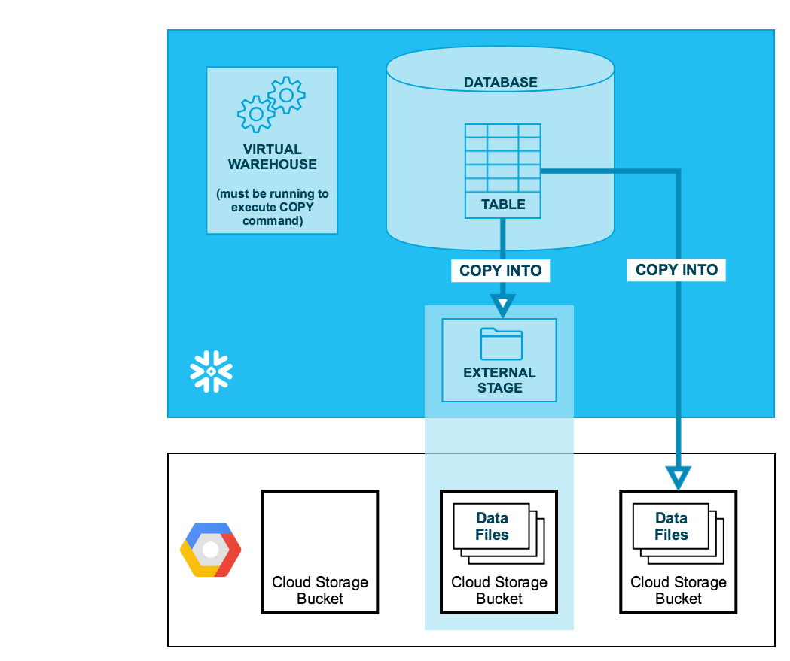

## Project Overview: Snowflake to GCS Data Migration

In this project, I focused on migrating large volumes of data from Snowflake to Google Cloud Storage (GCS) using Snowflake’s utility tool. The goal was to ensure data integrity and scalability while handling a significant number of tables efficiently.

### Key Steps and Approach:

1. **Assessment and Planning**: 
   - Analyzed the existing data architecture in Snowflake to understand the volume and structure of the data.
   - Identified key tables and datasets for migration, prioritising critical business data.
   - Decided to track and automate all the tables using multiple log tables which were also included in Store Procedures and automated using Snowflake Tasks.

2. **Utilization of Stored Procedures (SP)**:
   - Developed stored procedures to automate the extraction of data from Snowflake.
   - Stored procedures were used to manage data transformations and ensure consistency across various tables, making the process repeatable and scalable.

3. **Data Transfer with Snowflake Utility Tool**:
   
   - Used the Snowflake <b> "COPY INTO" </b> utility tool to export data into a format compatible with GCS integration.
     
```
COPY INTO externalStage 
    FROM { select * from t1}
PARTITION BY date
FILE_FORMAT = ( { FORMAT_NAME = '[<namespace>.]<file_format_name>' |TYPE = { CSV } [ formatTypeOptions ] } ) 
OVERWRITE = TRUE | FALSE
[ VALIDATION_MODE = RETURN_ROWS ]
[ HEADER ]
```
     
   - Configured the utility to handle batch processing, which is crucial for managing large data volumes and optimizing the transfer speed.

4. **Integration with Google Cloud Storage (GCS)**:
   - Established secure connections between Snowflake and GCS.

<p align="center">
  
</p>

   - Implemented scripts to automate the upload of data files to GCS buckets, ensuring data was stored in a structured and organized manner.

4. **Testing and Validation**:
   - Conducted thorough testing to validate the integrity of migrated data.
   - Implemented checks to verify data accuracy and completeness, ensuring that all critical business data was transferred without loss.

### Benefits and Impact:

- **Scalability**: The use of stored procedures and batch processing enabled the migration of large datasets without overloading system resources.
- **Efficiency**: Automated the entire migration process, reducing the time required to move data and minimizing manual intervention.
- **Reliability**: Ensured consistent and reliable data transfers, maintaining data integrity and supporting business operations.

By implementing this solution, I demonstrated my ability to handle complex data migration tasks, optimize workflows, and ensure seamless integration between different cloud platforms.
