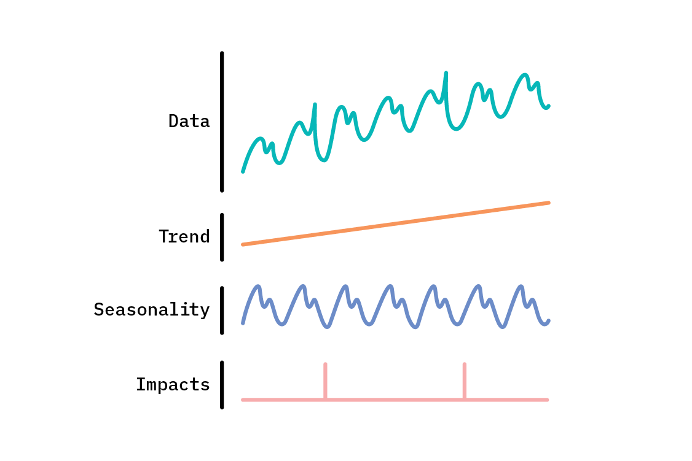
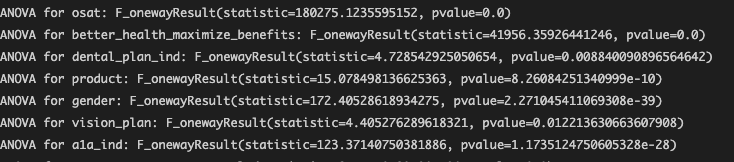
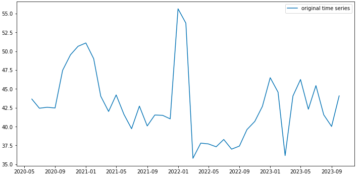
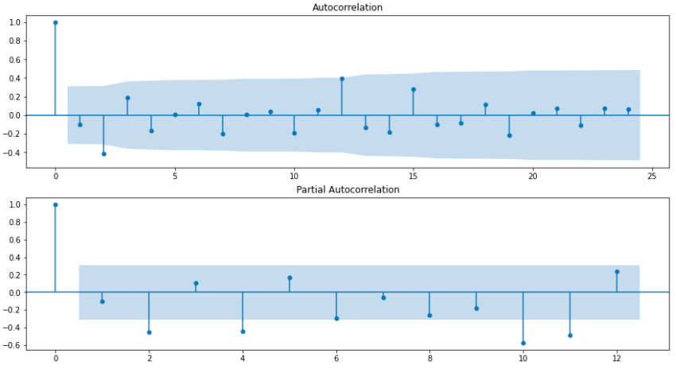
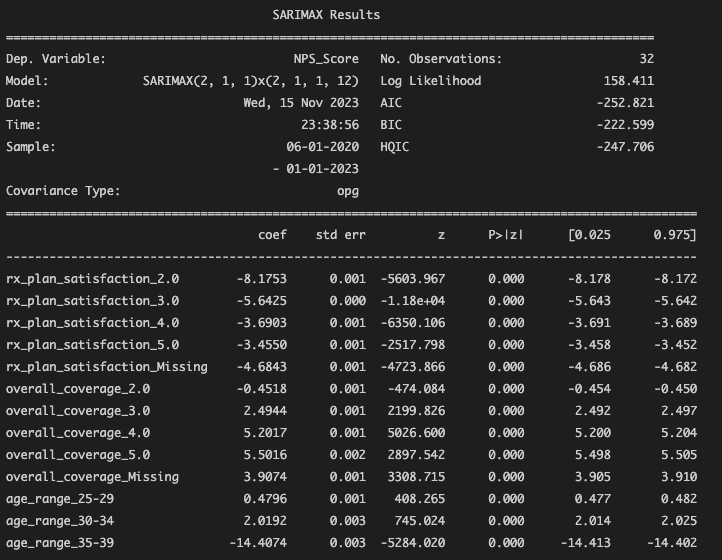
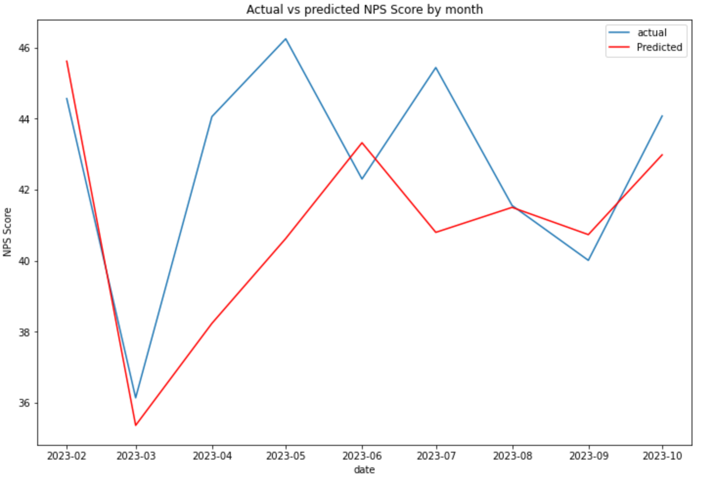

# Time Series Forecasting with SARIMAX: Real World Application


<div style="text-align:center;">
 
</div>


## Introduction

Imagine a retail company struggling to predict its monthly sales accurately, leading to overstocked inventory or missed revenue opportunities. Accurate forecasting is crucial for such businesses to make informed decisions and optimize their operations. In this article, we delve into the application of the `SARIMAX (Seasonal AutoRegressive Integrated Moving Average with eXogenous factors)` model for time series forecasting. This model extends the popular ARIMA model by including seasonal effects and external variables, making it highly suitable for complex forecasting tasks.


## Problem Statement

This project aimed to predict the `Net Promoter Score (NPS)` for the upcoming year using customer data from the health industry. The task involved identifying key variables influencing the NPS and assessing the impact of seasonality. The insights gained were intended to help the organization take targeted actions during risk months to enhance customer satisfaction and retention.


## Data Exploration

The dataset included customer feedback and various related variables from the health industry over several years. The goal of this exploration was to understand the trends and patterns in the NPS data, identify any seasonality, and select relevant variables for the forecasting model.

**Variable Selection with Correlation Analysis**:
   - The correlation between NPS (`ltr` Likelihood to Recommend - target variable) and other variables such as service usage, customer complaints, and demographic factors was analyzed.
   - This step was crucial in identifying potential exogenous variables that could be included in the SARIMAX model to improve forecasting accuracy.
```
##target variable
target = df['ltr']

##performing ANOVA
for all categorical columns 
for column in categorical_columns:
    categories = df[column].unique()
    anova_results = f_oneway(*[target[df[column] == category] for category in categories])
    if anova_results.pvalue < 0.05:
        print(f'ANOVA for {column}: {anova_results}')
```
<p>Output - </p>

<p align="center">
  
</p>

Here we can take the columns with p-value groups that do not have signification covariation as features, basically columns with p-value < 0.05.


- **Trend Analysis**: A time series plot of the NPS data revealed a general trend, with noticeable peaks and dips, suggesting potential seasonal patterns. (Can be seen in IMG-2)

- **Seasonal Decomposition**: Decomposing the time series into its trend, seasonal, and residual components confirmed the presence of annual cycles, which was essential for model selection.

- **Handling Outliers and Missing Data**: Outliers were identified and treated by capping extreme values to prevent skewed results. Missing data was addressed using forward filling to maintain the continuity of the time series.

This exploration provided the necessary insights to choose appropriate model parameters and ensure that the SARIMAX model could effectively capture the underlying patterns in the NPS data.


## Model Selection: SARIMAX

<p align="center">
  
</p>
<p align="center">
IMG 2: Seasonal Trend Of NPS
</p>

The SARIMAX model was chosen due to its ability to handle:
- **Seasonality**: Capturing recurring patterns within the data.
- **Exogenous Variables**: Incorporating external factors that might influence the target variable.

## Model Implementation

The SARIMAX model was implemented using Python's `statsmodels` library. The following steps were undertaken:

Before moving forward, it's essential to check if our data is stationary, as time series models like SARIMAX rely on consistent statistical properties over time. Non-stationary data can lead to inaccurate predictions, so ensuring stationarity helps the model capture patterns effectively, improving forecast accuracy.

```
esult=adfuller(new_ts)
test_statistic=result[0]
p_value=result[1]
print(test_statistic,p_value)
if p_value<=0.05:
    print("Data is stationary")
else:
    print("Data is not stationary")
```

<div style="background-color: #d4edda; padding: 10px; border-radius: 5px; border: 1px solid #c3e6cb;">
<pre>
Output - 
-2.6103435902509693 0.09087824674776257
Data is not stationary
</pre>
</div>

#### We made the data stationary by differencing the data by 1, so our d = 1

```

new_ts_diff = new_ts - new_ts.shift(1)
result_diff=adfuller(new_ts_diff.dropna())
test_statistic=result_diff[0]
p_value=result_diff[1]
print(test_statistic,p_value)
if p_value<=0.05:
    print("Data is stationary")
else:
    print("Data is not stationary")
```

<div style="background-color: #d4edda; padding: 10px; border-radius: 5px; border: 1px solid #c3e6cb;">
<pre>
Output - 
-4.83753828972209 4.6072160914343626e-05
Data is stationary
</pre>
</div>

1. **Parameter Identification**:

<p align="center">
  
</p>

 The `p`, `d`, `q`, `P`, `D`, and `Q` parameters were identified using ACF (AutoCorrelation Function) and PACF (Partial AutoCorrelation Function) plots.
   
```
model = SARIMAX(train, exog=exog_train,order=(2,1,1),seasonal_order=(2,1,1,12))
results = model.fit(disp=-1)
```

2. **Model Fitting**: The model was trained on historical data with missing data filled with the Moving Average method, the missing months are filled as in the above code our last input is 12 which tells the cycle of data in our case it is 1 year so 12 months.

```
model = SARIMAX(train, exog=exog_train,order=(2,1,1),seasonal_order=(2,1,1,12))
results = model.fit(disp=-1)
```

<p align="center">
  
</p>

### Results Summary

- **Key Variables**: Variables like `rx_plan_satisfaction_2.0`, `rx_plan_satisfaction_3.0`, and `age_range_35-39` negatively impact the NPS, while `overall_coverage_3.0`, `overall_coverage_4.0`, and `age_range_25-29` positively influence it. All are statistically significant with p-values of 0.000.

- **Fit**: The model fits well, with strong metrics (AIC: -252.821, BIC: -222.599), suggesting it accurately captures patterns in the data.

- **Takeaway**: The model highlights areas for improvement, particularly in customer satisfaction related to specific plan satisfaction and age groups.

3. **Model Evaluation**: Performance was evaluated using metrics like AIC (Akaike Information Criterion) and RMSE (Root Mean Square Error). The model's performance was further validated using out-of-sample data. Lets dive into this further in next part. 

## Results

The SARIMAX model successfully captured the underlying patterns and provided accurate forecasts for the NPS. The key results include:

<p align="center">
  
</p>

- Visualizations showing actual vs. predicted values, residuals, and forecast errors.
The SARIMAX model captures the overall NPS trend well, but minor differences between actual and predicted values suggest potential issues, such as missing data. Addressing these gaps could further improve prediction accuracy, though the model already demonstrates strong pattern recognition.

## Challenges and Improvements

While the SARIMAX model provided satisfactory results, the following challenges were encountered:

- **Overfitting**: Balancing the model complexity to avoid overfitting.
- **Data Limitations**: Handling missing data and outliers.

To improve the model, future work could include:

- Exploring other time series models like Prophet or LSTM.
- Incorporating more granular external data.

## Conclusion

In conclusion, the SARIMAX model effectively captures key variables influencing the NPS, such as rx_plan_satisfaction and age_range, highlighting areas where improvements can boost customer satisfaction. 
This project demonstrates the effectiveness of the SARIMAX model in time series forecasting, especially when seasonality and exogenous factors play a significant role. The model's ability to provide accurate predictions can be a valuable tool for businesses in any industry, enabling better decision-making and improving overall customer experience.

---

**Keywords**: Time Series, SARIMAX, Forecasting, Seasonal Effects, Exogenous Variables, Python, statsmodels

---
## About the Author

**Name**: Udveg Reddy Jukanti

**LinkedIn**: [linkedin.com/in/udveg-reddy](https://www.linkedin.com/in/udveg-reddy)

**Portfolio**: [udvegreddy.com](https://www.udvegreddy.com)

**GitHub**: [github.com/udveg](https://github.com/udveg)


---

