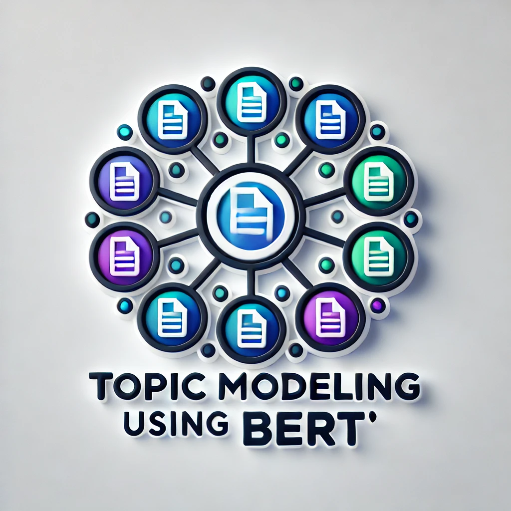
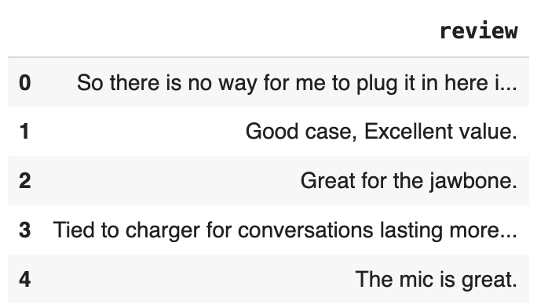
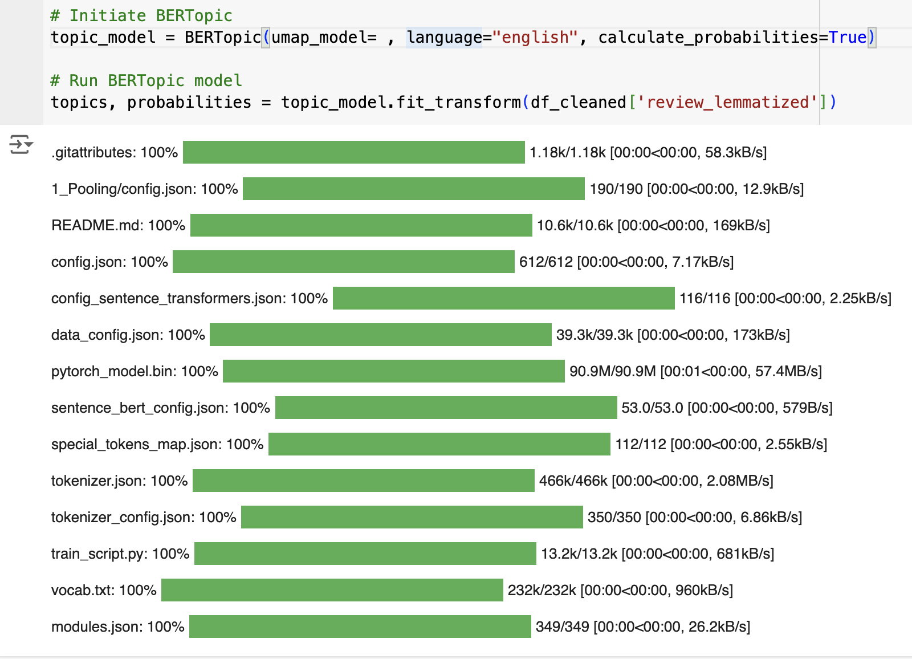
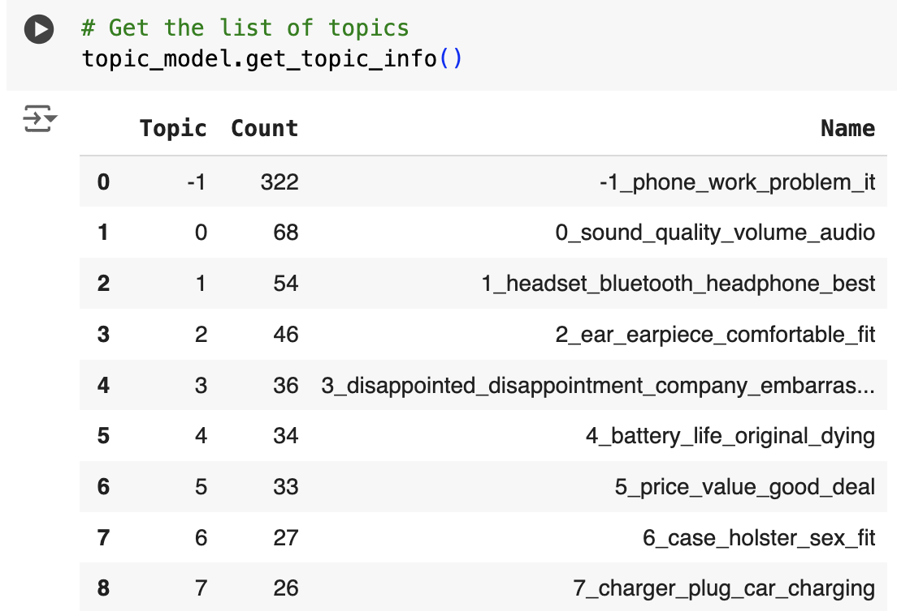
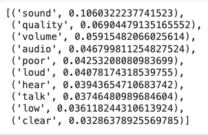
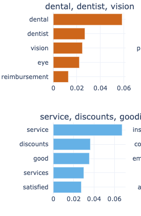
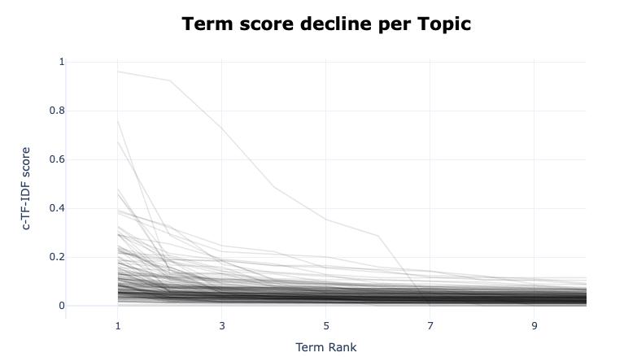
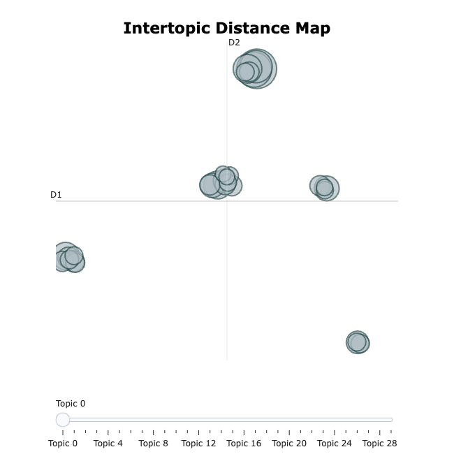
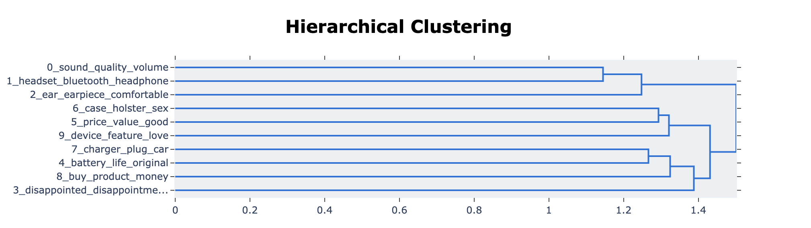

# Topic Modeling using BERTopic

<p align="center">
  
</p>


## Abstract
This paper explores the application of BERTopic ( Bidirectional Encoder Representations from Transformers), a transformer-based topic modelling library, for analyzing text data. By combining transformer embeddings with clustering models and a class-based TF-IDF (c-TF-IDF), BERTopic effectively identifies and interprets topics within textual data. This study demonstrates the topic extraction, prediction, and visualization process using BERTopic, showcasing its utility in natural language processing (NLP) tasks.

## Introduction
Topic modeling is a crucial technique in natural language processing (NLP) that facilitates the identification of hidden themes within large collections of text. Traditional methods like Latent Dirichlet Allocation (LDA) often struggle with scalability and lack contextual understanding, making them less effective for complex, large-scale datasets. Recently, transformer-based models such as ChatGPT have gained popularity for their impressive ability to generate coherent and context-aware text. However, for topic modeling tasks, BERTopic offers a unique advantage.

Unlike traditional NLP models, BERTopic utilizes BERT (Bidirectional Encoder Representations from Transformers), which reads text bidirectionally—from left to right and right to left—allowing it to capture deeper contextual relationships. This bidirectional reading enhances BERT's understanding of context, making it more adept at interpreting nuanced meanings in text. By leveraging BERT's capabilities and advanced clustering techniques, BERTopic provides a robust framework for extracting and analyzing topics with greater precision and interoperability.

## Overview 
#### This study uses survey data where respondents provided feedback on various products. By extracting and analyzing topics from these comments, we aim to provide businesses with actionable insights into customer sentiments and preferences, facilitating better-informed decisions.

<p>
  <u><strong>Note:</strong></u> Steps taken as part of the analysis are included in a Python code template, which you can download and use to perform similar analyses. <a href="https://github.com/udveg/Projects/tree/main/Projects/Topic_Modelling">Click here to redirect.</a>
</p>


## Methodology

### 1. Loading data and preprocessing
Steps include 
- Lemmatization
- Removing Stopwords
- Basic EDA

### 2. Dimensionality Reduction using UMAP
We can apply various dimensionality reduction techniques to this data; two of the most popular options are PCA and t-SNE. However, in this analysis, we will focus on using UMAP due to its ability to preserve both the local and global structure of the data, making it particularly effective for visualizing high-dimensional datasets.

 ##### Principal Component Analysis (PCA)
 ---
  Approach: Linear method that reduces dimensions by maximizing variance along principal components.
  
  Strengths: Simple, fast, and effective for capturing global structure in data.
  
  Limitations: Struggles with non-linear relationships and may miss local structures, making it less effective for complex data.
  
 ##### t-distributed Stochastic Neighbor Embedding (t-SNE)
 ---
Approach: Non-linear method focused on preserving local relationships by minimizing the divergence between high-dimensional and low-dimensional data points.

Strengths: Excellent for visualizing clusters and capturing local structures, highlighting subtle differences.

Limitations: Poor at maintaining global structure, suffers from the crowding problem, and is computationally intensive, which limits scalability for large datasets.

 ##### Uniform Manifold Approximation and Projection (UMAP)
 ---
Approach: Non-linear method that preserves both local and global structures using a combination of Riemannian geometry and algebraic topology.

Strengths: Balances local and global structure preservation, scales well with large datasets, and provides flexibility with adjustable parameters (n_neighbors, min_dist).

 ##### Key Differences:
Unlike PCA, UMAP effectively captures non-linear patterns.

UMAP provides a more scalable and globally-aware alternative to t-SNE, avoiding common pitfalls like the crowding effect while offering a clearer, more informative visualization of both small-scale and large-scale data structures.

```
# Initiate UMAP
umap_model = UMAP(n_neighbors=5,
                  n_components=7,
                  min_dist=0.0,
                  metric='cosine',
                  random_state=100)
```

### 3. BERTopic Overview
BERTopic combines three key components to achieve high-quality topic modelling:

- **Transformers**: These are used to generate dense vector representations (embeddings) of textual data. Transformers capture contextual relationships between words, which significantly improves the quality of topic modeling.
- **Clustering Algorithms**: The embeddings produced by transformers are clustered using algorithms such as HDBSCAN or K-Means. These clusters represent the different topics in the text corpus.
- **Class-based TF-IDF (c-TF-IDF)**: This technique refines the topic representation by considering the frequency of words within a cluster relative to other clusters. c-TF-IDF enhances the interpretability of topics by emphasizing words that uniquely represent a particular topic.

### 4. Topic Extraction and Interpretation
The BERTopic model first uses a transformer to generate embeddings for each document. These embeddings are then clustered, and c-TF-IDF is applied to extract representative keywords for each topic. This process helps in identifying coherent topics that are easy to interpret.

### 5. Visualization Techniques
Visualization is an integral part of topic modeling to aid in understanding the distribution and relationships of topics. BERTopic provides various visualization tools, such as:

- **Topic Hierarchy**: Visualizes the hierarchical relationships between topics.
- **Topic Similarity**: Shows the similarity between different topics using dimensionality reduction techniques like UMAP.
- **Topic Evolution**: Tracks how topics evolve over time, which is crucial for analyzing trends in temporal data.

## Experiments

### Data Collection and Preprocessing
For the purpose of this study, a dataset comprising various textual documents was used. The preprocessing steps included removing stop words, tokenization, and transforming text into lowercase to ensure consistency.
```
df.head()

```
<p>
  
</p>

Removing nulls
```
#Renamed the review column to Comments
df_cleaned = df.dropna(subset=['Comments'])
```
Removing Stopwords 
```
# Remove stopwords
stopwords = nltk.corpus.stopwords.words('english')
df_cleaned['review_without_stopwords'] = df_cleaned['Comments'].astype(str).apply(lambda x: ' '.join([w for w in x.split() if w.lower() not in stopwords]))
```
The above code will remove any stopwords like 'i', 'me', 'my', 'myself', 'we' and 'our'.

Next, Lemmatization refers to changing words to their base form. For example word like 'wasted' is converted to 'waste'. 

```
# Lemmatization
df_cleaned['review_lemmatized'] = df_cleaned['review_without_stopwords'].apply(lambda x: ' '.join([wn.lemmatize(w) for w in x.split() if w not in stopwords]))

```
### Applying BERTopic
The BERTopic model was applied to the preprocessed data. The embeddings were generated using a transformer model, followed by clustering using HDBSCAN. The topics were then extracted using c-TF-IDF, and visualization techniques were employed to interpret the results.

<p>
  
</p>

## Results
The application of BERTopic resulted in the identification of several distinct topics within the text data. Each topic was characterized by a set of keywords that provided insight into the underlying theme. The visualization tools further enhanced the interpretability of the topics by revealing their relationships and evolution over time.

- **Topic Extraction**: Now we have Successfully extracted topics, with key topics focusing on themes such as-
  
  From the image below, exclude Topic -1, which contains comments that the model could not interpret. These comments were grouped into Topic -1 due to containing unique or inconsistent words that didn't fit into the other identified topics.
  
  <p>Moving on to topic 0 or we can say 1 - `0_sound_quality_volume_audio`.</p> 
  We can understand this topic is about the Audio quality of whatever device this survey was taken about, similarly 2nd topic `1_headset_bluetooth_headphone_best` is about bluetooth headphone. 
  
  <p>
  
</p>

---

To understand a topic much better like key terms and their weight we can use the below query. 

```
# Get the top 10 terms for a topic
topic_model.get_topic(0)
```

<p>
  
</p>

The above info gives a much deeper sense of the topic for example for sure we know that the above topic is about sound quality. Now from this we can extract all records which fall under this topic and can understand better about sound quality issues. 

- **Visualization**: The BERTopic gives us various visualizations which we can use for better understanding.
  We'll go through some of them now -

The below query will provide top keywords used using a bar chart, the number of topics you want to visualise can be set using `top_n_topics`.

```
##Visualize top topic keywords
topic_model.visualize_barchart(top_n_topics=4, custom_labels=True)
```

<p align="center">
  
</p>

---
```
# Visualize term rank decrease
topic_model.visualize_term_rank()
```

The "Term Score Decline per Topic" chart provides another perspective on keyword importance. This chart uses a line graph format, with the term rank displayed on the x-axis and the c-TF-IDF score shown on the y-axis.
Generally, we will see a gradual decline in the trend because the term frequency for most of the sentences will eventually decrease in any sentence. 

<p align="center">
  
</p>

---
```
# Visualize intertopic distance
topic_model.visualize_topics()
```

The Intertopic Distance Map is useful for visualizing the relationships between different topics identified by the BERTopic model. It shows how closely related or distinct the topics are from each other. Topics clustered together indicate similar themes, while those farther apart represent more distinct topics. This visualization helps to quickly identify related topics and understand the overall structure of the content in the dataset.

<p align="center">
  
</p>

---
```
# Visualize connections between topics using hierachical clustering
topic_model.visualize_hierarchy(top_n_topics=10)
```

The Hierarchical Clustering chart visualizes the relationships and similarities between different topics identified by BERTopic. Each line represents a topic, and the branching structure shows how topics are grouped based on their similarity. Topics that are closer together merge at a lower distance, indicating they share common themes or keywords. This visualization helps in understanding the overarching themes within the dataset and how individual topics relate to each other. It’s useful for identifying closely related topics and potential sub-themes.

<p align="center">
  
</p>


## Discussion
The results demonstrate BERTopic's capability to handle large text corpora and provide meaningful topic representations. The use of transformer embeddings significantly improves the quality of topics, while c-TF-IDF and clustering techniques enhance the interpretability of results. The visualization tools offer additional insights, making BERTopic a comprehensive solution for topic modeling in NLP.

## Conclusion
This study highlights the effectiveness of BERTopic for topic modeling in natural language processing. BERTopic provides a robust framework for extracting, interpreting, and visualizing topics by integrating transformer-based embeddings with advanced clustering and visualisation techniques. Future work could explore optimizing BERTopic’s hyperparameters for different types of text data and extending its application to multilingual datasets.

## References
1. Grootendorst, M. (2020). BERTopic: Neural topic modeling with BERT. Available at: [URL for BERTopic GitHub or documentation]
2. Devlin, J., Chang, M. W., Lee, K., & Toutanova, K. (2019). BERT: Pre-training of Deep Bidirectional Transformers for Language Understanding. arXiv preprint arXiv:1810.04805.
3. McInnes, L., Healy, J., & Astels, S. (2017). hdbscan: Hierarchical density-based clustering. The Journal of Open Source Software, 2(11), 205.
